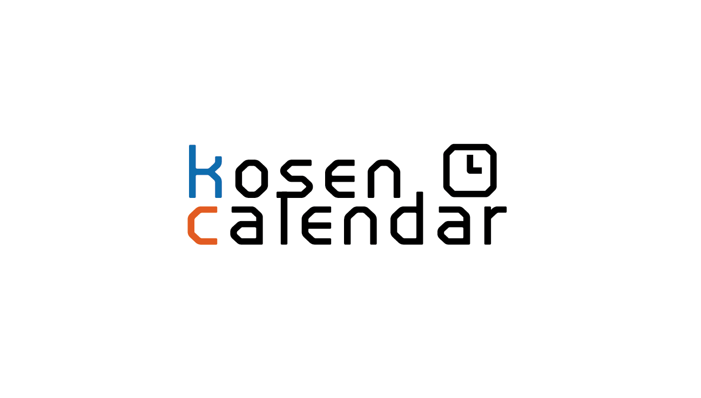

# kosen-calendar

各高専の行事予定をiCalendar形式で提供します。

# 公式サイト

https://kamekyame.com/contents/kosen-calendar

## 対応状況

ここに載っていないサービスは未確認です。

| サービス        | 対応状況 | 追加方法                      |
| ----------- | :--: | ------------------------- |
| Outlook.com |  ○   | 「予定表を追加」→「Webから定期受信」      |
| Googleカレンダー |  ○   | 「他のカレンダー」横の＋マーク→「URLで追加」  |
| iPhoneカレンダー |  ○   | iPhoneから下の追加したい高専のURLをタップ |

## 対応高専

| 学校番号   | 高専名      | URL                                                                                                                                                                                                           | 備考                            |
| ------ | -------- | ------------------------------------------------------------------------------------------------------------------------------------------------------------------------------------------------------------- | ----------------------------- |
| 703003 | 長岡高専     | https://kamekyame.github.io/kosen-calendar/nagaoka/nagaoka.ics                                                                                                                                                | 有志の方が手打ちで作ってくれました。            |
| 705006 | 石川高専     | https://kamekyame.github.io/kosen-calendar/ishikawa/ishikawa_2021.ics                                                                                                                                         | 有志の方が手打ちで作ってくれました。            |
| 705007 | 福井高専     | https://kamekyame.github.io/kosen-calendar/fukui/fukui.ics                                                                                                                                                    | 2022年度からPDFでの配布に変更されたため非対応です。 |
| 707003 | 津山高専     | https://kamekyame.github.io/kosen-calendar/tsuyama/tsuyama.ics                                                                                                                                                |                               |
| 708005 | 弓削商船高専   | https://calendar.google.com/calendar/ical/yugencmt%40gmail.com/public/basic.ics（共通） https://calendar.google.com/calendar/ical/6rtpjgchl917teni5o99sni1c0%40group.calendar.google.com/public/basic.ics（専攻科） | 弓削商船高専が直接公開しているカレンダーとなります。    |
| 709006 | 北九州高専    | https://kamekyame.github.io/kosen-calendar/kitakyusyu/kitakyusyu.ics                                                                                                                                          |                               |
| 709011 | 熊本高専(八代) | https://kamekyame.github.io/kosen-calendar/kumamoto/yatsushiro.ics                                                                                                                                            |                               |

## 協力お願い

各高専の行事予定を自動スクレイピングで毎年更新したいです。 そのために各高専のスクレイピングスクリプトを作ってくれると嬉しいです。

使用言語は`Javascript`,`Typescript`で、Denoを使って実装しています。
iCalendar形式に変換するclassもあるので、暇な方は協力お願いします。
